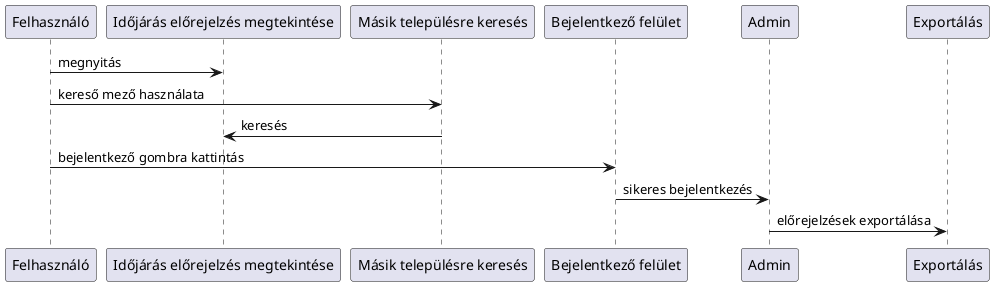

**Funkcionális specifikáció**

**Projektneve:** Időjáráselőrejelző rendszer

**Dátum**: 2025.11.14

**Készítette**: AFP1 csapat

**1.**    **Bevezetés**

Ez a dokumentum az AFP1 csapat által készített időjárás előrejelző rendszer működését írja le. Célja, hogy pontosan meghatározza, miként működjön a szoftver a különböző felhasználói interakciók hatására, milyen háttér folyamatok legyenek, hogyan jelenjen meg a weboldal a felhasználó számára.

**2.**    **Rendszeráttekintés**

A rendszer egy böngészőből elérhető webes, külső API-t használó időjárás előrejelző alkalmazás. A felhasználók a weboldal megynyitásakor látják a lokációjuk szerinti időjárás előrejelzéseket. Mutatja a követkeő órákban várható időjárás alakulást, illetve az elkövetkező 30 napnak az előrejelzéseit is. A napokra bontott előrejelzések esetén a várható minimális, maximális hőmérséklet értékeket is mutatni fogja.

Ha a felhasználó egy másik településnek kívánja megnézni az előrejelzéseit, akkor a weblap tetején levő keresőmezőbe a kívánt település nevét írva meg tudja nézni az ottani előrejelzést is.

Ezek mellett a felhasználónak rendelkezésére áll a szoftverhez implementált mesterséges intelligencia is, amely a weblapon mutatott időjárás alakulásának megfelelően öltözködési javaslatokat adhat. Melegebb időszakban vékonyabb ruházatot javasol, hidegebb időszakban pedig melegebb ruházatot, esetleg kabátot, sálat, sapkát is javasolhat.

A fenti funkciók minden alapszintű felhasználónak elérhető. Azonban nem tudják megnézni a már elmúlt előrejelzések adatait. Ez a funkció csak az admin jogosultsággal rendelkező felhasználónak érhető el, aki ki is tudja exportálni az eddigi előrejelzések adatait is. Ehhez két űrmezőbe kell beírnia a két dátumot, amelyek közötti napoknak az előrejelzéseit akarja exportálni.

Ha bejelentkezett a felhasználó, akkor ezt a böngésző sütijében elmenti, ezáltal a felhasználói élményt lehet javítani, hogy nem kell a felhasználónak mindig bejelentkeznie.

**3.**   **Felhasználói felületek**

    **3.1 Főoldal**

        ·    Előrejelzés órákra bontva

        ·    Előrejelzés napokra bontva

        ·    Keresőmező

        ·    Bejelentkező felület az admin felhasználónak

        ·    Mesterséges intelligencia csevegő fül

    **3.2 Keresett település előrejelzése**

        ·    Előrejelzés órákra bontva

        ·    Előrejelzés napokra bontva

        ·    Keresőmező

    **3.3 Admin oldal**

        ·    Előrejelzés órákra bontva

        ·    Előrejelzés napokra bontva

        ·    Keresőmező

        ·    Űrlapmező, hogy milyen napok előrejelzését akarja exportálni

        ·    Exportálás gomb

**4.**   **Funkcionális folyamatok**

    **4.1 Főoldal megnyitása**

        ·    A rendszer megnézi a felhasználó jelenlegi helyzetét az eszköze lokációja alapján

        ·    Az API segítségével lekéri a megkeresi a helyzetéhez legközelebbi településnek az előrejelzéseit

        ·    Megjeleníti a lekért adatokat a weblapon, mind az aznapit, mind a napokra bontott előrejelzéseket

    **4.2 Keresett település előrejelzése**

        ·    A felhasználó beír egy településnevet a keresőbe, majd megnyomja az Enter gombot

        ·    Ha megtalálta a települést, akkor az API segítségével megjeleníti a weblapon az adott település előrejelzéseit

        ·    Ha nem találta meg, akkor egy hibaüzenet segítségével tájékoztatja a felhasználót az interakció sikertelenségéről

    **4.2 Bejelentkezés admin felhasználóként**

        ·    A felhasználó rányom a bejelentkezés gombra

        ·    Megjelenik a weboldalon egy bejelentkező felület, ahova a felhasználónevet és jelszavat tudja beírni

        ·    Sikeres bejelentkezés követően visszatér a főmenübe, de megjelenik neki az exporálás funkció, és a böngésző elmenti a bejelentkezést a sütiben.

        ·    Sikertelen bejelentkezés esetén tájékoztatja a felhasználót a helytelen felhasználónév és jelszóról

        ·    Három sikertelen bejelentkezési kísérlet esetén a rendszer 5 percig nem engedi a felhasználót újra bejelentkezni.

    **4.2 Exportálás**

        ·    A felhasználó beírja az űrmezőkre, hogy mely napokra akarja az előrejelzéseket exportálni, majd rányom az exportálás gombra

        ·    A böngésző egy külső adatbázisba menti a megfelelő adatokat, illetve letölt egy .txt fájlt a megfelelő adatokkal

**5.**   **Adatmodell**

    **5.1 Előrejelzések**

        ·       ID

        ·       Dátum

        ·       Égbolt típusa

        ·       Minimális hőmérséklet

        ·       Maximális hőmérséklet

        ·       Csapadék mennyiség

**6.**   **Példa UML diagramok**

**7.**   **Rendszerkövetelmények**

    ·       Böngésző: Google Chrome, Microsoft Edge, Firefox legfrissebb verzió

    ·       Platform: számítógép

    ·       Backend: PHP, Javascript

    ·       Adatbázis: Apache szerveren MySQL

**9.**   **Elfogadási kritériumok**

    ·       Helyes előrejelzés.

    ·       Másik városra lehet keresni.

    ·       Megjeleníti a másik város előrejelzéseit is.

    ·       Be lehet jelentkezni admin felhasználóként

    ·       Admin felhasználóként lehet exportálni két dátum közötti előrejelzés adatokat

**10.****Jövőbeli bővítési** **lehetőségek**

    ·       Mesterséges intelligencia, ami megfelelő öltözködési javaslatot ad.

    ·       Az aktuális időjárás adatokat külön megjeleníti a weblap tetején.
